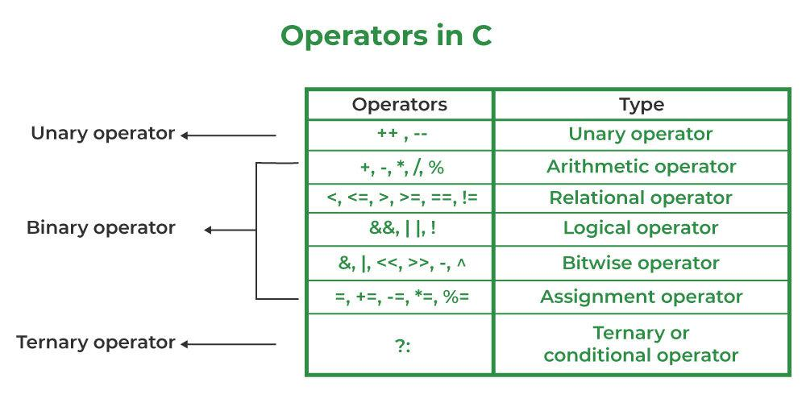

# Some equations
$$\sum_{n=1}^{\infty}\left( \frac{n \times (n + 1)}{2}\right)^2$$




<details>
  <summary>Click me</summary>
  
  ### Heading
  1. Foo
  2. Bar
     * Baz
     * Qux

  ### Some Code
  ```js
  function logSomething(something) {
    console.log('Something', something);
  }
  ```
</details>


<details> 
    <summary> Problems </summary>

- [Alice and Array](https://www.codechef.com/problems/ALCARR)
- [Split and Maximize](https://www.codechef.com/problems/SPLITMAX)
- [String Game](https://www.codechef.com/problems/ABSTRING)
- [Splitting Balls](https://www.codechef.com/problems/SPBALL)

</details>

<details> 
  <summary> C++ </summary>

  ```c++
  #include <bits/stdc++.h>
  using namespace std;
  int main() {
    vector<int> arr(5) {10, 20, 30, 40, 50};
    vector<int> prefix(5);
    int sum = 0;
    for (int i = 0; i < n; i++) {
        sum += arr[i];
        prefix[i] = sum;
    }
  }
  ```

</details>

<details> 
  <summary> Java </summary>

  ```Java
  import java.util.*;
  class Prefix {
    public static void main (String args[]) {
        Scanner sc = new Scanner(System.in);
        int arr[5] = {10, 20, 30, 40, 50};
        int sum = 0;
        int []prefix = new int[5];
        for (int i = 0; i < n; i++) {
            sum = sum + arr[i];
            prefix[i] = sum;
        }
        sc.close();
    }
  }
  ```

</details>


<details> 
  <summary> Python </summary>

  ```python 
  nums = [10, 20, 30, 40, 50]
  sum = 0
  prefix = []
  for i in range(len(nums)):
    sum += nums[i]
    prefix[i] = sum
  ```

</details>


## Sorting Techniques
<details>
  <summary> Bubble Sort </summary>
  
  

</details>